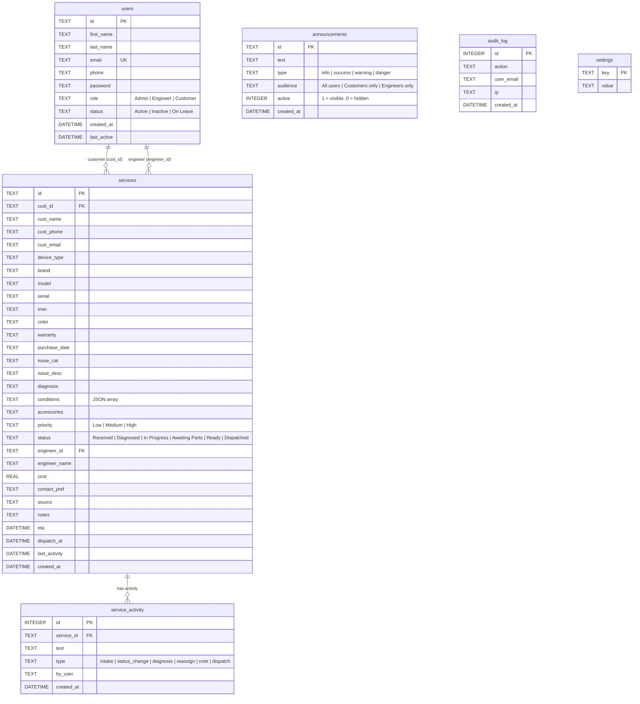

# Reparo — Database ERD

> Render with any Mermaid-compatible viewer (GitHub, VS Code + Mermaid extension, mermaid.live)

## Relationships

| From | To | Type | Via |
|---|---|---|---|
| `users` | `services` | one-to-many | `cust_id` — customer who owns the service |
| `users` | `services` | one-to-many | `engineer_id` — engineer assigned to the service |
| `services` | `service_activity` | one-to-many | `service_id` — timeline entries per service (CASCADE delete) |

## Standalone Tables

| Table | Purpose |
|---|---|
| `announcements` | Portal-wide notices shown to customers and/or engineers |
| `audit_log` | Immutable record of all admin actions |
| `settings` | Key-value store for all configuration (branding, SMTP, notifications, etc.) |
